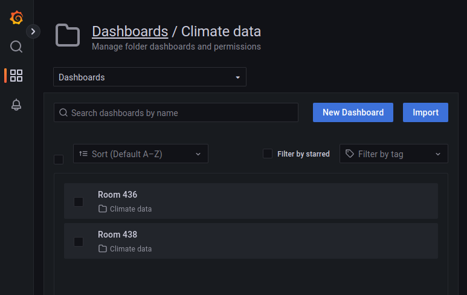
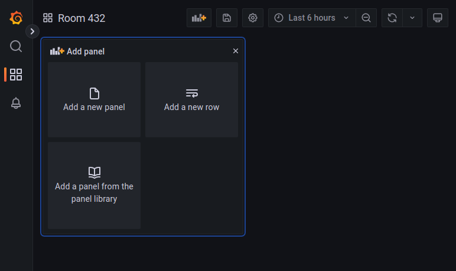
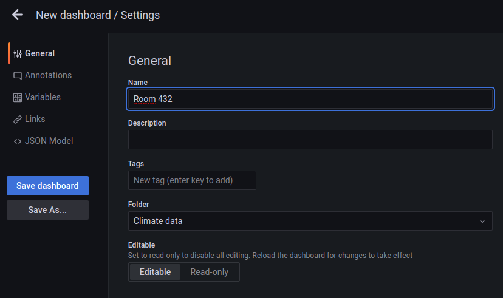
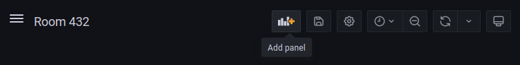
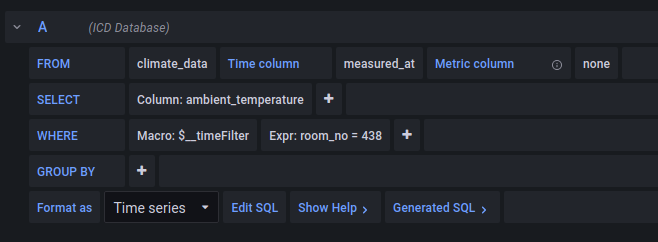
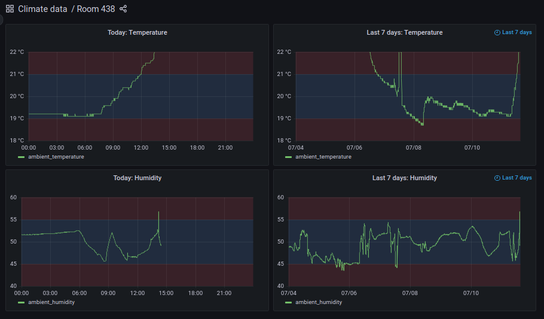

IVW Climate Data (ICD)
======================

# About
IVW Climate Data (ICD) is a framework for measuring,
storing, retrieving and visualizing atmospheric data.
Its intended main use is the documentation of the
quality of air conditioning in laboratories. For this,
it provides an API that sensor-equipped hardware clients
can use to submit recorded data. Specifically, ICD accepts
data on ambient temperature, ambient humidity and
atmospheric pressure. The stored data can then be retrieved
using the API or a GUI. ICD uses the third party library
Grafana as GUI.

# Data model
Climate data are represented by a custom data type:
**Api::V1::ClimateDatum** (abbreviated to ClimateDatum
throughout this document). Instances of this data type
represent measurements made by sensor clients. Therefore,
they have attributes for holding ambient temperature and
humidity as well as atmospheric pressure, as well as for
essential metadata that is associated with such measurements:
sensor id, measurement date and and time, room number and
installation position of the sensor within the room ('e.g.
next to door'). For the sake of simplicity, physical units
of the measured data are not represented explicitly but are
fixed by convention (to °C, % and hPa). Also, assuming that
climate data are not protected by copyright, no data is
collected on the identity of its creator.

Specifically, the attributes of **Api::V1::ClimateDatum** are:  
*   **id**  
    An unsigned integer that is assigned to a data item
    by the server. If provided during the submission of new data,
    any value will be overwritten by the server without further 
    notice. Ids assigned by the server are assured to be unique
    within a single instance of ICD.
*   **measured_at**  
    An ISO 8601-formatted, timezoned **timestamp**
    (e.g. 2022-07-07T01:48:52+1) that represents the date and time
    at which the climate data have been recorded. It should be provided
    by the client during submission. If left blank, **no** substitute
    or default value is filled-in by the server.
*   **ambient_temperature**  
    A **float** representing the measured ambient temperature (in °C).
*   **ambient_humidity**  
    A **float** representing the measured (relative) ambient humidity
    (in %).
*   **atmospheric_pressure**  
    A **float** representing the measured atmospheric pressure (in hPa).
*   **room_no**  
    An **integer** representing the number of the room in which the
    measurement was made.
*   **position**  
    A **string** representing the position within the room at which
    the measurement was made, e.g. 'at window', 'on southern wall'.
*   **sensor_id**  
    A **UUID (v4)** which represents the sensor with which the
    measurements were made.

There is one **meta data** item that is associated with instances
of **Api::V1::ClimateDatum**:

*   **received_at**  
    An ISO 8601-formatted, timezoned **timestamp** that represents the
    date and time at which the data were received by the server.
    Will be overwritten by the server if supplied by the client.

# Data format

Instances of ClimateDatum are formatted as follows:

```
{ 
  "data": {
    "id": 1,
    "type": "Api::V1::ClimateDatum",
    "attributes": {
      "ambient_temperature": 20.0,
      "ambient_humidity": 50.0,
      "atmospheric_pressure": 952.0,
      "room_no": 438,
      "position": "windows",
      "sensor_id": "79c53545-4e2a-4fa4-a880-0340c023a5de",
      "measured_at": "2022-07-22T14:31:20Z"
    },
    "links": {
      "self": "http://[YOUR-HOST]:3000/api/v1/climate_data/1.json"
    },
    "meta": {
      "received_at": "2022-07-22T14:38:11Z"
    }
  },
  "links": {
    "http://[YOUR-HOST]:3000/api/v1/climate_data.json"
  }
}
```
# Sensor clients
Sensor clients are pieces of hardware that collect data 
from sensors for ambient conditions and send this data to
ICD's server via HTTP to the API described below.

Requirements:

*   Collect sensor data at intervals (lower limit: 1 minute).
*   Construct JSON document according to the requirements of
    the API.
*   HTTP-POST well-formatted data to the server's API.
*   Evaluate response status code and cache data locally if
    response status is not within 200-299.
*   If data submission is successful, try to send any locally
    cached data afterwards. Doing so, make sure that data is
    submitted multiple times (i.e. remove any successfully
    submitted data from cache. Do not send cached data longer
    than 30 s. Postpone the sending of more cached data to the
    next execution iteration.
*   Additional user-specific requirements may apply, especially
    concerning the accuracy of sensor data and calibration of
    sensor equipment.

# API use

ICD features an API which supports the programmatic submission and
retrieval of climate data:

* host and port name, e.g. **http://icd.ivw.uni-kl.de:3000**
* **writing data requires an API token** for authentication
* reading data does not require authentication

| Request aspect   | Value                                                                                                                                                                                                                                                                                                                                                                                                                                                |
|:-----------------|:-----------------------------------------------------------------------------------------------------------------------------------------------------------------------------------------------------------------------------------------------------------------------------------------------------------------------------------------------------------------------------------------------------------------------------------------------------|
| URL              | http://[YOUR-HOST]:3000/api/v1/climate_data.json                                                                                                                                                                                                                                                                                                                                                                                            |
| HTTP Verb        | POST                                                                                                                                                                                                                                                                                                                                                                                                                                                 |
| Request body     | The request body MUST consist of an anonymous JSON document that represents a valid **set of attributes** of a ClimateDatum instance. The version of the ClimateDatum instance must not be specified, as it is already included in the URL that the post is made to. **Notice**: Only one instance can be submitted per request, issue multiple requests if needed.                                                                                  |
| Request params   | **api_token** (UUID v4, required): issued by the system admins, needed for authentication                                                                                                                                                                                                                                                                                                                                                            |
| Response         | The response contains an anonymous JSON representation of the newly created ClimateDatum instance. Only one instance is returned per response. The returned instance contains the **received\_at** meta information as set by the server. Large differences between measured_at and received_at are possible indicators of high network latency, temporary server unavailability or of a mismatch between the clocks of the server and the client.   |

**Submit data: Python example**

```
import requests
attributes = {
  "ambient_temperature": 20.0,
  "ambient_humidity": 50.0,
  "atmospheric_pressure": 952.0,
  "room_no": 438,
  "position": "windows",
  "sensor_id": "79c53545-4e2a-4fa4-a880-0340c023a5de",
  "measured_at": "2022-07-22T14:31:20Z"}
}
params={ 'api_token': [SECRET] }
url = 'http://[YOUR-HOST]:3000/api/v1/climate_data.json'
r = requests.post(url, json=attributes, params=params)
print(r.json())
```

Output:

```
{ 
  "data": {
    "id": 1,
    "type": "Api::V1::ClimateDatum",
    "attributes": {
      "ambient_temperature": 20.0,
      "ambient_humidity": 50.0,
      "atmospheric_pressure": 952.0,
      "room_no": 438,
      "position": "windows",
      "sensor_id": "79c53545-4e2a-4fa4-a880-0340c023a5de",
      "measured_at": "2022-07-22T14:31:20Z"
    },
    "links": {
      "self": "http://[YOUR-HOST]/api/v1/climate\_data/1.json"
    },
    "meta": {
      "received_at": "2022-07-22T14:38:11Z"
    }
  },
  "links": {
    "http://[YOUR-HOST]:3000/api/v1/climate\_data.json"
  }
}
```

**Retrieve data**

Retrieving data requires neither an API token nor any other form
of authentication. Data can be retrieved in two ways: by providing
a set of search parameters or by specifying an ID.

| Request aspect   | Value                                                                                                                                                                                                                                                                                                                                                                                                                                                                  |
|:-----------------|:-----------------------------------------------------------------------------------------------------------------------------------------------------------------------------------------------------------------------------------------------------------------------------------------------------------------------------------------------------------------------------------------------------------------------------------------------------------------------|
| URL              | http://[YOUR-HOST]:3000/api/v1/climate_data.json                                                                                                                                                                                                                                                                                                                                                                                                              |
| HTTP Verb        | GET                                                                                                                                                                                                                                                                                                                                                                                                                                                                    |
| Request body     | N/A                                                                                                                                                                                                                                                                                                                                                                                                                                                                    |
| Request params   | The following parameters are MANDATORY:<br /> **room\_no** (integer) room number<br />**from** (timestamp, ISO 6801) start date<br /> **to** (timestamp, ISO 6801) end date<br />Additionally, there is one OPTIONAL parameter:<br />**location** (string) restricts the results to the specified location within the specified room. The provided value must be an exact match of the positions in the database, pattern matching and partial hits are not supported. |
| Response         | The response body contains a key "data", whose value is an anonymous list of JSON representations of ClimateDatum instances which match the provided search parameters. It will be empty of no records matched the parameters. Additionally, it contains a "links" key, whose value is a collection of links, which consists of only one link. This link represents the request that produced the data in this document.                                               |

**Python example**

```
import requests
query_params = {
  "room_no": 438,
  "from": "2022-07-07",
  "to": "2022-07-08"
}
url = 'http://[YOUR-HOST]:3000/api/v1/climate_data.json'
r = requests.get(url, params=query_params)
print(r.json())
```

Output

```
{
   "data":
    [
      {
        "id": 1,
        "type": "Api::V1::ClimateDatum",
        "attributes": {
          "ambient_temperature": 20.0,
          "ambient_humidity": 50.0,
          "atmospheric_pressure": 952.0,
          "room_no": 438,
          "position": "windows ",
          "sensor_id": "79c53545-4e2a-4fa4-a880-0340c023a5de",
          "measured_at": "2022-07-22T14:31:20Z"
        },
        "links": {
          "self": "http://[YOUR-HOST]:3000/api/v1/climate_data/1.json"
        },
        "meta": {
          "received\_at": "2022-07-22T14:38:11Z"
        },
      },
      { 
        "id": 2,
        "type": "Api::V1::ClimateDatum",
        "attributes": {
          "ambient_temperature": 19.0,
          "ambient_humidity": 48.0,
          "atmospheric_pressure": 952.0,
          "room_no": 438,
          "position": "windows",
          "sensor_id": "79c53545-4e2a-4fa4-a880-0340c023a5de",
          "measured_at": "2022-07-22T14:31:20Z"
        },
        "links": {
          "self":  "http://[YOUR-HOST]:3000/api/v1/climate_data/2.json "
        },
        "meta": {
          "received\_at":  "2022-07-22T14:55:27Z "
        }
      },
      # ... more data instances ommitted for brevity
    ],
  "links": {
    "self": "http://[YOUR-HOST]:3000/api/v1/climate_data.json?room_no=438&from=2022-07-07&to=2022-07-08"
  }
}
```

# Assigning API tokens

API tokens are assigned by the system administrator by inserting
corresponding records into the api_tokens table of the climate_db
database.

For this, log-in to the postgresql terminal using psql and execute
the following commands:
```
\c climate_db  
INSERT INTO api_tokens (token, created_at, updated_at)
  VALUES (gen_random_uuid(), CURRENT_TIMESTAMP, CURRENT_TIMESTAMP)
  RETURNING token;
```

Optionally include a string for the **issued_to** field,
which should identify the hardware client to which the
token is issued or the client's administrator:

```
\c climate_db  
INSERT INTO api_tokens (token, issued_to, created_at, updated_at)
  VALUES (gen_random_uuid(), 'room-432-climate-client', CURRENT_TIMESTAMP, CURRENT_TIMESTAMP)
  RETURNING token;
```

# GUI use

ICD uses the [Grafana observability framework](https://grafana.com)
for providing a user-configurable tool for data visualization,
monitoring and alerting. For this, the key entities of Grafana are:

* [data sources](https://grafana.com/docs/grafana/latest/datasources/)
  which will be ICD in this scenario,
* [panels](https://grafana.com/docs/grafana/latest/panels/)
  (which actually display data),
* [dashboards](https://grafana.com/docs/grafana/latest/dashboard/)
  (which are collections of panels), and
* folders, which are collections of dashboards.

**Visualize data with panels**

In order for users to be able to create their own panels, they need to be assigned to corresponding rights to do so. This has been done for the ["Climate data" room](http://131.246.251.61:3001/dashboards/f/mlLaKc6nz/climate-data). Go there...



... and click on "New dashboard"...



... which will generate a new dashboard named "New dashboard". In order to change this default name, click on the settings icon (the gear on the top-right) and then enter the name of the new dashboard, e.g. "Room 432":



Configure all other the settings of your new dashboard (refer to the Grafana manual for details on all options) and then click on "Save dashboard". Then click on "Add panel" and "Add a new panel"...



... to create a new panel from scratch. Consider using [panel libraries](https://grafana.com/docs/grafana/latest/dashboards/manage-library-panels/) for faster creation of recurring panel layouts.

Then, configure your panel's data query:

*   First, set the data source to "ICD Database".
*   Then, set "FROM" to "climate_data",
*   "TIME COLUMN" to "measured_at"
*   and "SELECT" to the quantity that should be displayed.
*   Under "WHERE" add a new Expression by clicking on '+' and set the key-value pair so that the data gets limited as desired, e.g. room\_no = 438. Add more where-clauses as required, e.g. sensor\_id = 'SOME UUID v4' to restrict data to one sensor if multiple sensors are installed in one room.



As soon as the query is complete, valid and yields any data, the plot on the top of the page gets updated. Modify the query until it displays as desired. Add more queries to display multiple curves in one panel, e.g. to include data from sensors at different locations in the same room, or to display temperature and humidity of one sensor in a joint diagram.

Add more panels to your dashboards until all data is visualized as desired:



# Installation

```
# set up a server that runs Ubuntu 22.04 
# set server clock and timezone, ideally using an ntp service 
# connect/switch to the server
# clone this repo
cd ivw-climate-data-public  
# the following commands will use your system's ruby
# use rvm or rbenv as alternatives
sudo apt install ruby-full gem update --system  
gem install bundler  
bundle install  
# check if postgresql is installed  
sudo service postgresql status  
# if not, install postgresql  
sudo apt install postgresql postgresql-contrib libpq-dev  
# login and create climate users  
sudo -i -u postgres  
psql  
CREATE DATABASE climate\_db;  
CREATE USER climate_user WITH PASSWORD 'your_password';  
GRANT CONNECT ON DATABASE climate_db TO climate_user;  
GRANT USAGE ON SCHEMA public TO climate_user;  
GRANT ALL PRIVILEGES ON DATABASE climate_data TO climate_user;  
CREATE USER climate_reader WITH PASSWORD 'other_passwort';  
GRANT CONNECT ON DATABASE climate_db TO climate_reader;  
GRANT USAGE ON SCHEMA public TO climate_reader;  
GRANT SELECT ON climate_data TO climate_reader;  
# as both users are no actual users, peer authentication will fail  
# therefore, edit the pg_hba.conf-file  
sudo nano /etc/postgresql/14/main/pg_hba.conf  
# add the following two lines below "local is for Unix domain socket connections only"  
local climate_db climate_user md5  
local climate_db climate_reader md5  
# create ~/.pgpass  
*:*:climate_db:climate_user:your_password  
*:*:climate_db:climate_reader:other_password  
# change access to .pgpass  
chmod 0600 ~/.pgpass  
# restart sql server
sudo service mysql restart
# verify login to db  
psql -U climate_user -d climate_db  
psql -U climate_user -d climate_db  
# create database either by migration  
rake db:migrate
# or by loading a dump  
psql -d climate_data < NAME_OF_DUMP.sql  
# find ip of server with ifconfig  
sudo apt install net-tools  
ifconfig | grep 'inet'  
# start rails server  
rails s -b 0.0.0.0 -p 3000  
# verify with browser  
# should show the rails default screen  
http://[YOUR-HOST]:3000  
# if the database was created from scratch using db:migrate
# the following command should return an empty json document
http://[YOUR-HOST]:3000/api/v1/climate_data.json?from=2022-07-1&to=2022-07-2&room=438  
# install grafana  
sudo apt-get install -y adduser libfontconfig1  
wget https://dl.grafana.com/enterprise/release/grafana-enterprise_9.0.2_amd64.deb  
sudo dpkg -i grafana-enterprise_9.0.2_amd64.deb  
rm grafana-enterprise_9.0.2_amd64.deb  
sudo nano /etc/grafana/grafana.ini  
# DO NOT set [server] / http_addr to "the IP" so that it will respond to requests to different IPs  
# set [server] / http_port to 3001  
# DO NOT set [database]-attributes, so that grafana will use sqlite  
# set [auth.anonymous] / enabled = true  
# set [auth.anonymous] / org_role = Editor  
sudo systemctl start grafana-server  
sudo systemctl status grafana-server  
# enable auto-start after boot
sudo systemctl enable grafana-server.service  
sudo tail /var/log/grafana/grafana.log  
# login with admin/admin,  
# change password  
# add climate_db as "ICD Database" data source  
# create folder 'user-defined'  
# go to folder, change permissions of Editor role to Admin  
# logout as admin  
# restart grafana server
sudo systemctl restart grafana-server
sudo systemctl status grafana-server
# verify with browser  
http://[YOUR-HOST]:3001/dashboards
```
